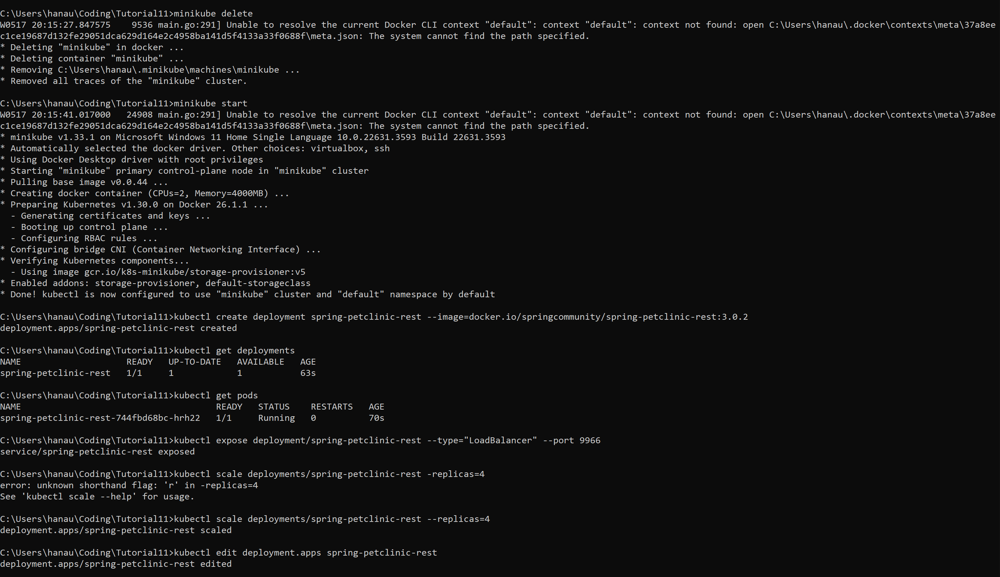
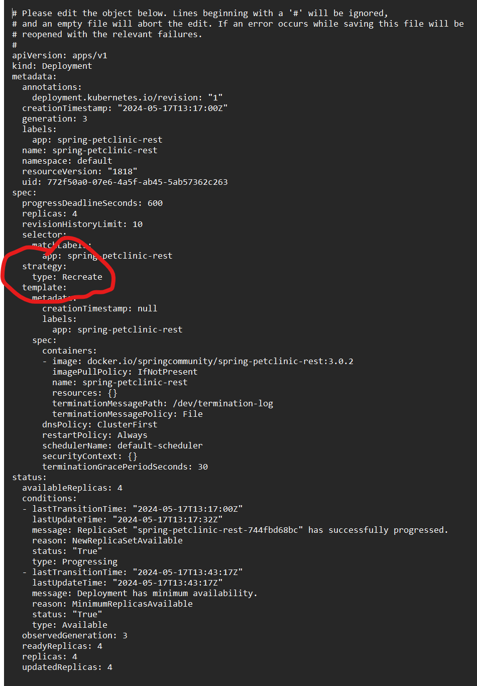
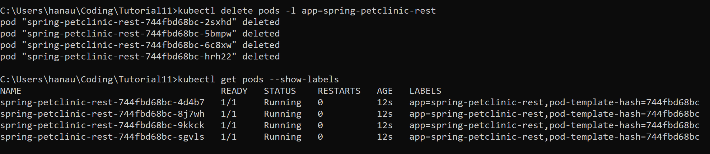

# Reflection on Hello Minikube

1. Compare the application logs before and after you exposed it as a Service. Try to open the app several times while the proxy into the Service is running. What do you see in the logs? Does the number of logs increase each time you open the app?

Terdapat perbedaan antar logs pertama dan kedua. Pada gambar pertama saya membuka app sebanyak 2 kali dan pada kedua saya membuka app 8 kali. Hal tersebut dapat dilihat dari banyak jumlah GET /

2. Notice that there are two versions of `kubectl get` invocation during this tutorial section. The first does not have any option, while the latter has `-n` option with value set to `kube-system`. What is the purpose of the `-n` option and why did the output not list the pods/services that you explicitly created? 

    Pada kubernetes, -n adalah flag yang digunakan untuk menentukan dari namespace mana service kita ingin ambil. Namespace sendiri cukup penting dalam kubernetes jika terdapat banyak user dalam suatu environments yang tersebar dalam beberapa team atau proyek. Dengan namespace, kita dapat menggunakan resources dengan nama yang sama dalam namespace yang berbeda.

# Reflection on Rolling Update & Kubernetes Manifest File

1.  What is the difference between Rolling Update and Recreate deployment strategy?  
Pada Strategy Rolling Update, pods lama akan direplace dengan pods yang baru secara bertahap. Dengan strategy ini, maka akan ada pod yang tetap tersedia. Sementara itu, strategy Recreate deployment akan memberhentikan semua pod lama sebelum membuat pod baru sehingga akan ada downtime.

2.  Try deploying the Spring Petclinic REST using Recreate deployment strategy and document your attempt.  

3. Prepare different manifest files for executing Recreate deployment strategy  
    manifest filesnya adalah deploymentV2.yaml

4. What do you think are the benefits of using Kubernetes manifest files? Recall your experience in deploying the app manually and compare it to your experience when deploying the same app by applying the manifest files (i.e., invoking `kubectl apply -f` command) to the cluster.  
Menurut saya, menggunakan manifest files adalah cara yang sangat efisien untuk deploy karena kita tidak perlu mengkonfigurasi secara manual sebelum deploy.